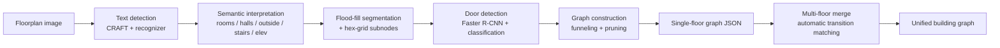

# Tesseract++ — Floorplan Parsing to Navigable Graphs

Tesseract++ converts annotated building floorplan images into navigable, multi-floor graph representations. It combines text detection, semantic interpretation, room segmentation, and door detection into a pipeline that produces typed graphs (rooms, corridors, doors, outdoor areas, stairs/elevators) with geometric edge weights — suitable for pathfinding, accessibility analysis, egress studies, and downstream spatial reasoning.

This repository accompanies the journal extension of *Tesseract* (SIGSpatial'25).



## Highlights

- **Room-family funneling** with a proven guarantee: every room point reaches every room door using a number of intra-room edges *linear* in the subnode count (spanning-tree construction, validated by ablation).
- **Automatic inter-floor transition matching** (`--auto-match`): infers which stairs/elevators on adjacent floors are the same physical shaft, via wall-mask registration (similarity transform + ICP polish + phase correlation, mirror-aware) and globally optimal assignment **with a rejection option** — shafts that terminate stay unmatched. Manual mapping files remain fully supported and always take precedence when provided.
- **Conservative, verified pruning**: 59% node / 82% edge reduction with **0.00% route-length inflation** and a ~4× query-time speedup on the evaluation floor.
- **Typed transitions enable real downstream tasks**: stairs-forbidden (elevator-only) routing and per-room egress-distance analysis ship as ready-made evaluations.
- **A reproducible evaluation suite** (`evaluate_*.py`) covering matcher robustness, funneling ablation, door-knockout sensitivity, corridor-density trade-offs, pruning ablation, and text-detection accuracy. See [`docs/EVALUATION.md`](docs/EVALUATION.md).

## Repository Layout

```
Tesseract++/
├── config.py                   # single source of truth for all repository paths
├── Main.py                     # entry point: single-floor pipeline
├── MultiFloor.py               # entry point: multi-floor merge + auto matching
├── app.py                      # entry point: FastAPI web interface
├── requirements.txt
├── evaluation/                 # reproducible evaluation suite
│   ├── evaluate_metrics.py         # metric layer over all processed graphs
│   ├── evaluate_matcher.py         # auto-matching robustness (synthetic)
│   ├── evaluate_funneling.py       # 3-way intra-room connectivity ablation
│   ├── evaluate_door_knockout.py   # connectivity under detector degradation
│   ├── evaluate_corridor_density.py# corridor sampling density trade-off
│   ├── evaluate_pruning.py         # pruning keep-term ablation, pre/post
│   ├── evaluate_downstream.py      # accessibility routing + egress distances
│   └── evaluate_text_accuracy.py   # label detection/recognition accuracy
├── utils/                      # graph construction, flood fill, matching, metrics
│   ├── graph.py                #   BuildingGraph: nodes, edges, funneling, pruning
│   ├── transition_matcher.py   #   registration + assignment-with-rejection
│   ├── metrics.py              #   completeness / reachability / components
│   └── app_utils/              #   web app internals
├── Models/                     # text detection (CRAFT), interpreter, door models
├── Model_weights/              # NOT tracked - place checkpoints here (*.pth)
├── data/
│   ├── floorplans/             # input floorplan images (see Data Notes)
│   └── mappings/               # transition mapping files (manual + AUTO_*)
├── results/
│   ├── single_floor/           # per-image outputs (Json / Plots / Time&Meta)
│   ├── multi_floor/            # merged building graphs (Jsons / Plots / Time&Meta)
│   └── evaluation/             # outputs of the evaluation suite
├── paper/                      # journal manuscript sources
└── docs/                       # documentation (EVALUATION.md)
```

## Input Conventions

The pipeline consumes **annotated** floorplans: semantic classes are seeded by text labels on the drawing. Recognized vocabulary (case-insensitive):

| Label on drawing | Interpreted as |
|---|---|
| any number (`1001`, `0006`, …) | room (the number becomes the room name) |
| `Hall` | corridor |
| `NA` | outside / non-navigable region |
| `Stairs`, `Stair`, `Staircase` | stairs transition node |
| `Elev`, `Elevator`, `Lift` | elevator transition node |

Drawings without `Hall`/`NA`/`Stairs`/`Elev` labels will not produce corridors, outdoor regions, or transitions (door classification requires all five semantic classes and will fail with fewer). The `…upE` filename suffix marks drawings that were manually enhanced with these labels.

Floor indices are parsed from the filename prefix: `B2`/`B1` (basements, −2/−1), `GF` (0), `FF` (1), `SF` (2), `TF` (3), or a leading number.

## Installation

Tested with Python 3.12 and CPU PyTorch 2.9.1:

```bash
python -m venv tess
source tess/bin/activate
pip install --upgrade pip setuptools wheel
pip install torch torchvision torchaudio --index-url https://download.pytorch.org/whl/cpu   # CPU build
pip install -r requirements.txt
```

Model weights are not committed. Place under `Model_weights/`:
- `craft_mlt_25k.pth` (CRAFT text detector)
- door detector weights expected by `Models/Door_Models/door_bboxer.py`
- recognizer weights expected by `Models/Interpreter/text_interpreter.py`

## Usage

### Single floor

```bash
python -u Main.py "FF part 1upE.png"
# optional: corridor sampling density (default 20 px)
python -u Main.py "FF part 1upE.png" --corridor-distance 40
```

Outputs land in `results/single_floor/{Json,Plots,Time&Meta}/`.

### Multi-floor — automatic (recommended)

```bash
# infer the stairs/elevator correspondence, write data/mappings/AUTO_*.txt,
# validate it, and run the full merge:
python MultiFloor.py --auto-match "FF part 1upE.png:SF part 1upE.png"

# inspect the inferred mapping without merging:
python MultiFloor.py --auto-match "FF part 1upE.png:SF part 1upE.png" --auto-dry-run

# tune rejection (higher = force more pairings), override floors:
python MultiFloor.py --auto-match "GF part 1upE.png:FF part 1upE.png" --reject-cost 0.15 --floors 0:1
```

The inferred mapping file records registration provenance (transform, wall-agreement chamfer, coverage) and per-match cost/confidence, and emits explicit `WARNING` lines when the registration is weak, mirrored, or supported by fewer than two aligned shafts — review it like any hand-written mapping.

### Multi-floor — manual mapping

```bash
python MultiFloor.py --mapping-file data/mappings/FF_SF.txt
python MultiFloor.py --mapping "(1, FF part 1upE.png, stairs_1):(2, SF part 1upE.png, stairs_1)"
```

Mapping format and validation rules (image existence, floor adjacency N±1, one-to-one, filename consistency) are documented in the header of `data/mappings/FF_SF.txt`.

### Web interface

```bash
python app.py   # FastAPI + bundled frontend
```

## Evaluation Suite

Each script prints a summary and writes CSV/figures under `results/evaluation/`:

| Script | Question it answers |
|---|---|
| `evaluate_metrics.py` | completeness / exit reachability / components for every processed graph |
| `evaluate_matcher.py` | is automatic transition matching robust to shift/rotation/scale, twin shafts, terminating shafts? |
| `evaluate_funneling.py` | what does funneling buy vs dense wiring vs one-node-per-room? |
| `evaluate_door_knockout.py` | how does connectivity degrade as door detection worsens, per door type? |
| `evaluate_corridor_density.py` | what does corridor node density actually buy? |
| `evaluate_pruning.py` | which pruning keep-terms are load-bearing; what does pruning cost? |
| `evaluate_downstream.py` | accessibility (stairs-forbidden) routing and egress distances on merged graphs |
| `evaluate_text_accuracy.py` | label detection / recognition rates against hand-enumerated ground truth |

Headline numbers and methodology: [`docs/EVALUATION.md`](docs/EVALUATION.md).

## Data Notes (read before drawing conclusions)

- `SF part 1upE.png` is a **byte-identical copy** of `FF part 1upE.png`, present only so the multi-floor machinery has a two-floor smoke test. Results derived from the FF↔SF pair exercise the pipeline but do **not** constitute evidence on genuinely different floors.
- `GF part 1upE.png` is `LF part 1.png` (a genuinely different, lower-floor drawing) with the semantic labels added programmatically; label placement should be verified against the real building before the derived graphs are treated as ground truth.
- Genuine multi-floor evaluation requires real per-floor drawings of the same building; the automatic matcher and its synthetic robustness suite are designed to slot such data in with no code changes.

## Known Limitations

- Inputs must follow the annotation conventions above; unlabeled or style-diverse drawings are out of scope.
- All distances are in pixels — no metres-per-pixel scale is estimated yet.
- Registration assumes similarity transforms (uniform scale); mirrored drawings are detected and flagged, not silently corrected; floors sharing fewer than two true shaft correspondences rely on wall-mask evidence alone.
- Single-run registration+matching on partially overlapping floor sections is conservative: expect unmatched shafts and review warnings rather than forced pairings.

## Citation

If you build on this work, please cite the Tesseract conference paper (SIGSpatial'25) and, where relevant, CRAFT (Baek et al., 2019) and Faster R-CNN (Ren et al., 2015). Manuscript sources for the journal extension live in `paper/`.
